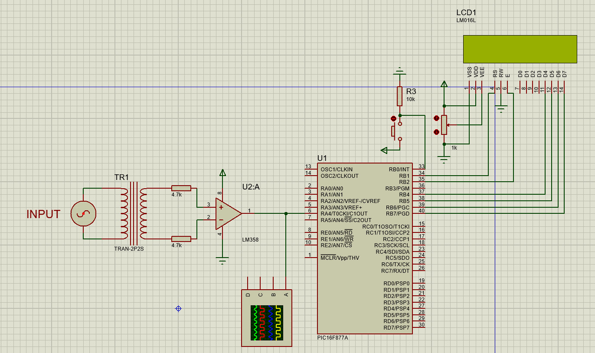

# Frequency Measurement with PIC 16F877A

This project demonstrates frequency measurement using the PIC 16F877A microcontroller. It utilizes the MikroC compiler and an LCD for output.

## Description

The project measures frequency by counting the number of pulses within a specific time interval using the PIC 16F877A's Timer0 module. It employs an interrupt routine to handle the counting process and displays the frequency on an LCD screen.

## Hardware Setup

### LCD Pinout Settings
- LCD_RS: RB1
- LCD_EN: RB2
- LCD_D7: RB7
- LCD_D6: RB6
- LCD_D5: RB5
- LCD_D4: RB4

### Pin Direction
- LCD_RS_Direction: TRISB1
- LCD_EN_Direction: TRISB2
- LCD_D7_Direction: TRISB7
- LCD_D6_Direction: TRISB6
- LCD_D5_Direction: TRISB5
- LCD_D4_Direction: TRISB4

## Variables
- `Fr_string[10]`: String variable to store the frequency value for LCD display.
- `comp`: Counter variable to count the number of pulses within a time interval.
- `compTime`: Counter variable to keep track of time intervals.
- `freq`: Variable to store the calculated frequency.

## Interrupt Function
- The interrupt function is triggered by an external interrupt (INTF).
- It clears the LCD screen, resets Timer0, and starts counting pulses.
- After counting, it calculates the frequency and displays it on the LCD.

## Main Function
- Initializes the LCD display.
- Enables global and external interrupts.
- Configures Timer0 for external clock source and rising edge trigger.
- Enters an infinite loop to keep the program running.

## Usage
1. Set up the hardware according to the provided pinout settings.
2. Compile and upload the code to the PIC 16F877A microcontroller using MikroC.
3. Power up the circuit.
4. Connect the signal source to be measured.
5. The LCD will display the measured frequency in Hertz (Hz).

## License
This project is licensed under the MIT License - see the [LICENSE](LICENSE) file for details.

## Acknowledgments
- This project was created using the MikroC compiler.
- Thanks to the PIC 16F877A microcontroller for its versatile features.
- Special thanks to the open-source community for their valuable contributions and support.
